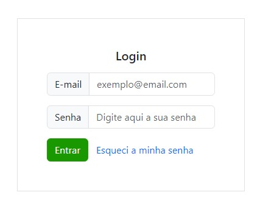
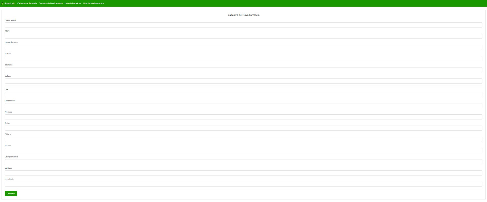
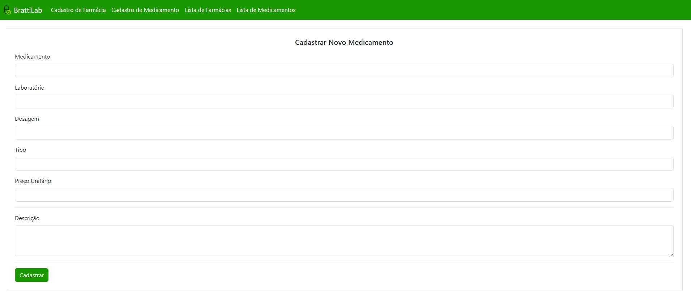
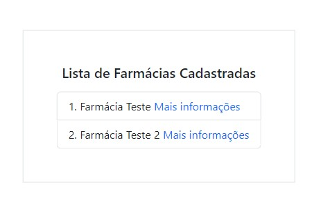
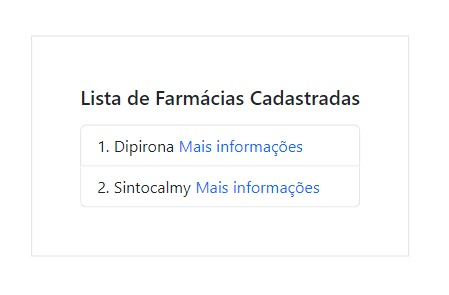

# Bratti Central Lab

O Bratti Central Lab é um sistema que foi desenvolvido para que empresas do setor farmacêutico possam fazer o cadastro de novas farmácias e medicamentos em seu banco de dados. Facilitando todo o processo de atendimento e entrega de seus produtos.


## Demonstração

A primeira etapa do sistema é realizar o login com um e-mail válido e uma senha de no mínimo oito caractéres:



Após o login o usuário será direcionado para uma página referente ao cadastro da farmácia, e deverá preencher todos os campos pedidos no formulário:



Realizando essa etapa, o usuário será direcionado para uma terceira página, onde efetuará o cadastro do medicamento, completando todos os inputs do formulário:



A seguir, será direcionado para uma página com uma listagem das farmácias já cadastradas:



E por último, uma nova página com a lista de medicamentos cadastrados no processo:



## Instalação

Faça o download do repositório, instale a pasta node_modules e depois as dependências utilizadas no projeto:

```bash
  npm install

  npm install bootstrap@5.3.0-alpha3

  npm install jquery popper.js sass

  npm install react-router-dom

```

Também será necessário iniciar o funcionamento da API abrindo uma nova janela do VS Code, selecionando a pasta da API, abrindo um terminal e dar o comando:

```bash
  npm install

  npm start

```
    
## Suporte

Para suporte, mande um email para filipebratti@hotmail.com


 
